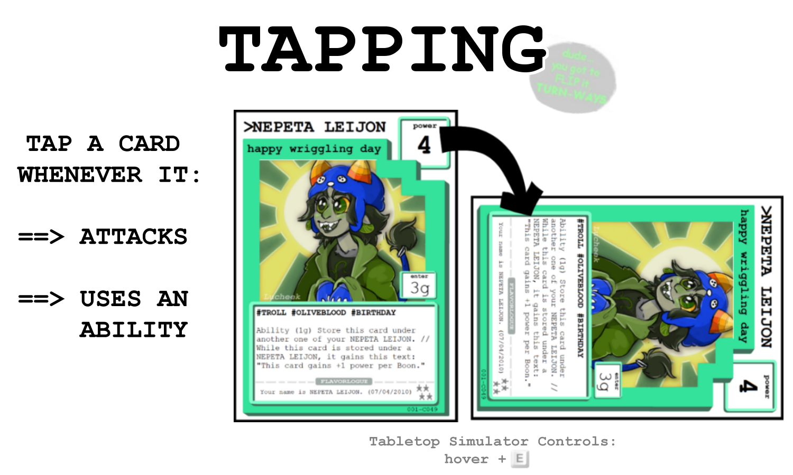

Rule Book Build: December 2025

**Homestuck: ATCG** is a competitive card-based game for 2-5 players, similar to a trading card game, but with a deck-building mechanic that utilizes point-buy instead of randomized booster packs.

*Note: Play-Testing as of now has only been made for 2 player games.*

The game is designed to be played on the virtual platform, Tabletop Simulator, made by Berserk Games, and available through the Steam application.

## Before You Play
Before the game begins, all players must assemble their own deck in a process called “deck-building.” Every deck contains a total of 49 cards, with exactly one Planet Card included- but not every player's deck will be the same. *Deck-Building specifics will be covered later*.

**It is encouraged new players start with a pre-built deck (“Pre-Con”) for their first few games.** After a player understands the game play, building their own deck will allow them to optimize their chosen strategy.

## Goal of the Game
The winner of the game is the player who has the **most Victory Points (“VP”)** at the end of the game.

Players will score Victory Points by sending invaders to their opponent's planets and **overpowering opponent's planet and it's defenders**. However, players must make sure to defend their own planet from invaders, too!

Players will each take **turns** being the active player- and each turn is made up of multiple **phases**. When every player in the game has taken a turn, a new **round** begins.

Rounds continue with every player taking a turn, until any player has earned at least 7 VP. **The first time any player has 7+ VP at the end of a turn, this triggers the “end-game.”** Every other player besides the current player gets one more turn and then the game is over- and a winner is decided.

    <h3>Advanced</h3>
    
It's possible to earn VP during another player's turn, and thus it's possible to trigger end-game on another player's turn. The player with 7+ VP still gets their one additional turn in this scenario.

## Setting Up the Game
Every player puts their Planet Card into play in the “Planet Card” location on their play mat, with the Intact side face-up. (*The Intact side is the side with power!*)

Then, every player will shuffle the remaining cards in their own deck, and put the deck face-down. **Each player will draw five (5) cards from their own deck** and keep these in their hand, hidden from their opponents. This is their starting hand.

    

        <h3>Tabletop Simulator Controls</h3>
        <dl class="grid grid-cols-2">
            <dt>Shuffle a Deck</dt>
            <dd>Hover over Deck + “R” Key</dd>
            <dt>Draw 5 Cards into your Hand</dt>
            <dd>Hover over Deck + “5” Key</dd>
        </dl>
    

    

        <h3>Advanced</h3>
        
If you don't like the five cards you drew first, you may mulligan. A mulligan means putting all of the five cards back into the deck, shuffling again, and drawing another five cards to be your starting hand. Every time you mulligan, every other player gets 1 grist.

    

After all players have a starting hand- each player will roll a six-sided dice, re-rolling for any ties, and the player who rolled the highest number will have the first turn as the active player.

(The next active player is always the next player in a clock-wise order.)

The very first active player in a game will skip drawing any cards in their very first Prep Phase.

## Your Turn
A turn is made of multiple phases that must be completed in order. The first phase is the Prep Phase, which *prepares* you and your cards for action.

After the Prep Phase, the Main Phase happens. The Main Phase is where most of the player decisions and interaction happens. When the Main Phase is completed- either because the active player chooses to end it or they have no more grist to spend- the Score Phase begins. *Every action in the Main Phase must be resolved completely before the Score Phase begins*.

The Score Phase is when power totals at each planet are calculated, and players can earn Victory Points. **The Score Phase is skipped for the first Round**.

The final phase in a turn is Boon Phase.

    <h3>Phases of a Turn</h3>
    
PREP ==> MAIN ==> SCORE* ==> BOON

    
* Skipped in the First Round

### Prep Phase
#### Get Grist
The Prep Phase always begins by the Active Player earning Grist. Grist (g) is the currency in which players buy actions, such as playing cards, moving cards, using abilities and attacking. Most actions in the game will require grist to perform.

The amount of grist they earn during the Prep Phase depends on the highest number of VP *any* player in the game has. Grist is always based off the current highest VP earned by any player- *not necessarily the VP of the active player*. Only the active player gains Grist during their own Prep Phase.

<table class="p-4 mb-8 text-sm lg:w-1/3 mx-auto text-center">
    <thead>
    <tr>
        <th scope="col">Victory Points Earned ==></th>
        <th scope="col">Grist Earned</th>
    </tr>
    </thead>
    <tbody>
    <tr><td>0 VP</td><td>3g</td></tr>
    <tr><td>1-2 VP</td><td>5g</td></tr>
    <tr><td>3-5 VP</td><td>6g</td></tr>
    <tr><td>6+ VP</td><td>9g</td></tr>
    </tbody>
</table>

Grist is recorded by hexagon tokens kept near the player's deck. The green side indicates 1g, and the flipped-over blue side is 3g.

**A player can never have more than 12 grist**. If they would ever earn more grist when they already have 12, instead nothing happens.

**Players can choose to build up grist between turns**- they do not need to spend all the available grist every turn.

    

        <h3>Tabletop Simulator Controls</h3>
        <dl class="grid grid-cols-2">
            <dt>Flipping a Token/Card Over</dt>
            <dd>Hover over Token/Card + “F” Key</dd>
        </dl>
    

    

        <h3>Advanced</h3>
        
If any card says a player will earn additional grist in their Prep Phase, such as an effect on a Planet Card, the player will resolve that effect at the same time as the regular amount of grist gained. (They will gain this grist before refreshing or drawing.)

    

#### Refresh Cards
After a player gains Grist, they will *refresh* any and all cards they control at any location that are tapped. When a card is refreshed, it's turned upright and vertical. You *must* refresh every card that you control if it's tapped- you can't choose to keep it tapped.

(Tapping happens during the Main Phase, so there will not be any cards to refresh on your very first turn.)

#### Draw Cards
Now, you'll draw at least 1 card from your deck into your hand.

*If you are the very first player in the game, on your very first turn, you won't draw at all.* Every other turn after will always require a player draw at least one card.

    <h3>Tabletop Simulator Controls</h3>
    <dl class="grid grid-cols-2">
        <dt>Draw 1 Card into your Hand</dt>
        <dd>Hover over Deck + “1” Key</dd>
    </dl>

If your Planet Card is intact (face-up), you may *choose* to draw an *additional* amount of cards listed on the Planet's “Draw” attribute. You do not have to draw all the extra cards, but **you must decide if you'll draw the extra cards before you draw any cards at all**.

If your deck is empty when you need to draw a card, you have to immediately **mill**. When you mill, you shuffle your Discard Pile and return it to your Deck face-down, and continue drawing. **Whenever you mill, every other player gains +2 VP**. Thus, you want to make sure you're milling as little as possible. Milling can happen during any phase- whenever you need to draw and do not have cards in your deck.

    <h3>Advanced</h3>
    
The Nullified Pile is separate from the Discard Pile for a reason. Nullified Cards do not return to your Deck when you mill.

There is no “hand-limit”- you can have any number of cards in your hand. You can not choose to discard cards from your hand without playing them.

### Main Phase
Unlike the Prep Phase, where the same actions must be performed in a specific order, during a player's Main Phase they can mostly choose the order and type of actions they complete.

The actions an active player can choose during their Main Phase are:

- *Play* a Card from their Hand
- *Move* a Character Card
- *Attack* with a Character Card
- Activate the *Ability* of a Character Card
- *End* you Main Phase early

As long as you have grist, you may continue to take actions during your Main Phase. *If you ever have 0 Grist, and all actions have fully resolved, your Main Phase ends automatically.*

However, if you want to end the Main Phase with grist remaining- you may choose to end early (after all previous actions have fully resolved.) Remember though, you can *never* have more than 12 Grist!

#### Play a Card
Playing a card (also known as “entering” the card) means moving a card from your hand onto the table. Cards must always be in-play before they have any sort of effect on the game.

To play a card, you must first pay it's Enter Cost in full. This is found on middle right-hand side of the card, in a box labeled “Enter.” Most cards have an enter cost of grist.

**You can choose to enter a Character Card to any location**. Your own character at your own planet is a *defender*, while your character at any opponent's planet is an *invader*. A character does not need to start at your own planet, but can be directly played as an invader.

**Inventory cards can only enter play as “attached” to the specific card type listed on that Inventory Card**. They can not be in-play without something to attach to. However, you can choose to attach them to any in-play card that fits the requirements, at any location.

**Executable cards enter play only in your Executable Zone**. When you play an Executable Card, make sure you arrange them in your Executable Zone in the order you play them, left-to-right. (*This is very important for when Executable Cards are triggered, as they resolve left-to-right.*) You can not re-arrange or move Executable Cards once they are played.

There are some cards that have an Enter cost listed as “~ATH: (X)” ~ATH (*read as Tilde-ath, or “'til Death”*) is Executable coding.

As an Enter cost, this means that card can not be played until the (X) card has been discarded or destroyed. When the triggering card is discarded or destroyed, you may choose to *immediately* play that card. You do not *have* to enter a card with an Executable Enter Cost when it is triggered- you can choose to keep it in your hand. However, you can *only* play these cards immediately after the triggering card is discarded or destroyed. (If you choose not to enter the card then, you must wait until it's triggered again.)

You can play Executable coded Enter Cost cards during any player's turn- as long as it's immediately after a triggering card was discarded or destroyed. You can also play these cards to any appropriate location, just like cards with an enter cost of grist.

    <h3>Advanced</h3>
    
A card is still considered “destroyed” when it is nullified.

**Example 1:**

“GAMZEE MAKARA / The Mirthful Messiahs” has an enter cost of “~ATH: Any #TROLL.” You have the card in your hand.

During your opponent's main phase, they attack and destroy your defending #TROLL card. You can now choose to put “GAMZEE MAKARA / the mirthful messiahs” into play, even as an invader. However- because it's not your main phase- your card can not attack or use an ability yet.

**Example 2:**

During your main phase, you attack and destroy your opponent's invader #TROLL. You can now choose to put “GAMZEE MAKARA / the mirthful messiahs” into play, because the code says “any” #TROLL- not specifically your own #TROLL. You can immediately choose to have the card attack, because it is your own Main Phase.

#### Move a Character Card
Once your character card has entered, they can change their location to a new planet or moon by being moved. **Moving a character card always costs 2 grist**- no matter what their enter cost is. The 2 grist must be paid *before* a character moves.

Moving does not tap a character card, but tapped character cards can’t be chosen to be moved!

    <h3>Advanced</h3>
    
A character will always loose all boons when it moves- even if the movement is caused by effect from an ability or other card during any player's turn.

Any Inventory card that is attached to the character moves with the character it's attached to. *Inventory can not be moved on it's own*.

Executable Cards can not be moved or re-arranged.

#### Tapping

    <h3>Tabletop Simulator Controls</h3>
    <dl class="grid grid-cols-2 mb-6">
        <dt>Rotate a Card</dt>
        <dd>Hover over the Card + “E” Key</dd>
    </dl>

The amount of rotation per key-press depends on the rotate setting- click on the setting on the top of the screen to change it to 90 degrees to reduce key-presses.

When a card is “tapped”, the card is physically rotated 90 degrees and put on it's side. **Once a card is tapped, it can not be tapped again until it is refreshed**. You can't choose to take any action with your own card that would cause it to be tapped more than once. *Choose wisely*.

#### Attack with a Character Card
**You can attack with any character card by paying 1 Grist and tapping the card.** (*All* character cards can attack, and to attack *always* costs 1g, so the attack rules are not printed on each card.)

When a character card attacks, compare it's current power with the power of all opponent's characters at the same location- the "targets". **Any opponent's character card with less power than the attacking card is destroyed**. If an opponent's character card has *equal or greater power*, the opponent's card is *not* destroyed in an attack.

It's important to understand that when a character attacks, it's attacking *all* opponent's cards at that location- battles are not fought solely between two cards. **A single attack can destroy multiple cards**.

    <h3>Advanced</h3>
    
In games with 3 or more players, other player's cards at the location are still “opponent's cards”- even if you are both invaders to that location.

Attacking is the most common way to reduce an opponent's power at any location, thereby allowing you to overpower an opponent. However, remember that destroying cards can trigger effects from Executable Code for any player- even if it not their turn. Player's strategy might involve baiting attacks to “sacrifice” cards for these effects!

    

        <h3>Advanced</h3>
        
The power on the character card is called the card's “Printed Power.” Power can be changed from effects from other cards, which make up the card's “Current Power.”

        
Current Power is variable, and always the value referenced for any rule that calls for a card's “Power.” Printed Power is sometimes referenced, but only specifically by the term “Printed Power.”

    

    

        <h3>Advanced</h3>
        
When a card's game text references “resisting” power, this power is added to the card's current power only when it is defending against an attack or ability- not when it is attacking or using an ability. Otherwise, power is both offensive and defensive.

    

#### Activate a Character Card's Ability
Every character card can attack, but only some character cards can use an ability. **Abilities** are a special type of game text that must be chosen to be activated, after trigger conditions are met, to take any effect. Abilities are written as “Ability (Trigger)- Effect.” When a card uses an ability, it is tapped.

The trigger for abilities must be met in full before the ability's effect happens, and an ability's trigger can vary between cards.

**“Xg” means an amount of grist to be paid**, just like taking the Enter, Move, or Attack options. (IE: The grist is removed to activate the ability.)

“Xb” means an amount of boons that the card must have on it. **These boon triggers are not 'paid'- as in, these boons are not removed from the card**- unless the ability states otherwise. However, boon triggered abilities still must be chosen to be used. (You can choose to not activate an ability even if you have the proper trigger.) Boon Triggers *only* reference the boons on the character card using an ability, so you can't “borrow” or “share” boons from other cards.

    <h3>Advanced</h3>
    
Some abilities can destroy cards in a very similar way to attacking. However, this is still considered using an ability- not an attack. Any reference to “attacks” does not effect abilities, even if the outcome would be the same.

#### Ending Main Phase
A player's Main Phase ends automatically if they reach 0 Grist- *even if they have more actions they could take without paying grist (such as boon- triggered abilities)*. A player might also choose to declare their Main Phase to end early, saving up some grist for their next turn.

In either case, the Main Phase always continues, “wrapping up,” until all current effects and triggers are resolved. The most common example of this is resolving effects of played Executable Cards.

#### Resolving Executable Cards
When a card is discarded, it can trigger ~ATH Code in Executable Cards and in ~ATH Enter Cards.

~ATH Enter Cards resolve first- starting with the active player, and continuing clockwise. Each player can choose to enter as many ~ATH Enter Cards in their hand as were triggered- they can also choose to only enter some, or none, of them.

Executable Cards resolve after all ~ATH Enter Cards triggered by the same event. **Executable Cards are not optional**- they will always be resolved and discarded when they are triggered, even if their effect has no valid target.

The right most triggered Executable Card of the Active Player resolves first, and then continues with the next clockwise player's right-most triggered Executable Card. Each player only activates one Executable Card (at most) before continuing to the next clockwise player's right-most triggered card.

Because of these timing rules, Executable Cards should always be played from right-to-left in the order they entered, and can not be re-arranged.

Some Executable Card's effects will trigger more, subsequent Executable and ~ATH Code Enter cards. **These subsequent triggering event's Executable and ~ATH Code Enter Cards are resolved only after all previously triggered cards are resolved**.

If multiple cards are discarded at the same time, that trigger different ~ATH Codes, the card further down in the Discard Pile is considered the first triggering event. *Players can always choose the order they put cards destroyed at the same time into their own Discard Pile*. (They cannot re-arrange them later.)

If a card is nullified, it's considered at the very bottom of it's player's Discard Pile for the purpose of timing only. The Active Player's Discard Pile is the top- most Discard Pile for this purpose, too.

<!-- @TODO: Better look for the gallery -->

<button x-data="{}" x-on:click.stop="const img = $el.querySelector('img'); $dispatch('img-modal', { imgModalSrc: img.src, imgModalAlt: img.alt })">

</button>

<button x-data="{}" x-on:click.stop="const img = $el.querySelector('img'); $dispatch('img-modal', { imgModalSrc: img.src, imgModalAlt: img.alt })">

</button>

<button x-data="{}" x-on:click.stop="const img = $el.querySelector('img'); $dispatch('img-modal', { imgModalSrc: img.src, imgModalAlt: img.alt })">

![Active Executable Cards are resolved after all ~ATH: Enter Cards. Active Executable Cards that are triggered always resolve -- they are not optional. The Active Player's right-most triggered Executable Card resolves first, then continues to the next player in clockwise order's right-most triggered Executable Card. After that, the Active Player's next right-most card resolves, and then continues to the clockwise player. From the cards that still need to be resolved in Figure 2, the order of resolution is bottom player's left-most card, middle player's card, and then bottom player's right-most card.](../images/rules/RuleImage_Execuables_Fig3.png "Resolving Executables: Figure 3")
</button>

<button x-data="{}" x-on:click.stop="const img = $el.querySelector('img'); $dispatch('img-modal', { imgModalSrc: img.src, imgModalAlt: img.alt })">

</button>

<button x-data="{}" x-on:click.stop="const img = $el.querySelector('img'); $dispatch('img-modal', { imgModalSrc: img.src, imgModalAlt: img.alt })">

![If the Executable Card's effects trigger more Executable Cards, the first group of triggers is resolved totally before the next round starts to be resolved. Continuing from Figure 4, the bottom player's right-most card must be resolved next, as it was part of the original set of executables triggered. Then, the new group of executables begins with the ~ATH Enter executable in the middle player's hand is resolved, and then the middle card in the bottom player's executable area is resolved, concluding the process.](../images/rules/RuleImage_Execuables_Fig5.png "Resolving Executables: Figure 5")
</button>

It is advised you go slowly and remain in communication with other player's to avoid *extra* confusion about timing.

### Score Phase
Remember: The Score Phase is skipped until the first turn of the second round!

**During the Score Phase, every player checks the power of their own cards at each Planet**. At their own Planet, they will include the power of their Planet Card (if it is intact) and their Defenders. At every other planet, they will only include the power of their own characters. (They do not combine their character's power with another player's character's power, even if they are both invaders.)

**Any player who has an invading force that is has greater total power than the defending power gains 1 Victory Point**, and the defending planet card (if it is intact) will take damage equal to the difference between Invading and Defending power.

**The power is totaled at every planet during every player's score phase**- not just the Active Player's.

If there are *multiple* players who have greater invading power at a planet, they *all score a Victory Point*.

If a Planet Card has reached it's **maximum amount of damage, it's flipped to the destroyed side and is considered destroyed**. (*However, Planet Cards do not move into the Discard Pile*.) Even when a Planet Card is destroyed, the location is still considered a “Planet”- but the player doesn't benefit from the effects on the intact Planet Card.

Planet Cards that are destroyed can trigger Executable Cards in the Score Phase, which are resolved after all power totals have been calculated and victory point earnings and destruction resolved.

**If a player ever earns Victory Points while their Planet Card is destroyed, they will flip their Planet Card back to the intact side, with no damage**. “Restoring” their planet card, as this is known, is an effect is triggered like an Executable.

    <h3>Advanced</h3>
    
A Planet can not be Destroyed and Restored in the same Score Phase by default. “Restored” takes priority.

As soon as any player reaches 7 Victory Points, the final round (known as “End Game” begins.) The Active Player will finish their turn in the Boon Phase, and then every other player will get a turn to be the Active Player. Now, the game is complete, and the player with the highest amount of Victory Points is the winner.

    <h3>Advanced</h3>
    
If the result is a tie in Victory Points at the end of the End Game Round, another round is played. This extra round is still considered “End Game.”

### Boon Phase
During the Boon Phase, the Active Player will put **a Boon on all their own untapped character cards at their planet**.

A card can only hold a maximum of three Boons. Once a card has three Boons, they do not gain anymore boons until they have less than three again.

**Boons do not have an effect naturally**, but many cards reference Boons for game-text. Even a Card doesn't have a current use for Boons, the Active Player should put boons on their untapped cards at their own planet during the Boon Phase.

Only the Active Player gains Boons during their own Boon Phase.

## Deck Building
Every Homestuck ATCG deck must meet the following criteria:

<ul class="list-none homestuck-list">
    <li>Total of 49 Cards</li>
    <li>Exactly 1 Planet Card</li>
    <li>No more than 2 copies of any card with the exact same <em>Name</em></li>
    <li>The total amount of <em>Star Value</em> for the deck does not exceed 200</li>
</ul>

A Card's *Name* is both the all-caps *TITLE* and all-lowercase *subtitle*. There is no limit on how many cards can share a TITLE, as long as there is no more than 2 cards with the exact same name.

The Star Value of a card is noted on the bottom right of the card, as a picture of 1-5 stars. In the game itself, Star Value is irrelevant- **Star Value is only a metric for Deck-Building**. When you add the total amount of stars for a deck together- *including the Planet Card and any repeated cards* - the value can not exceed 200.

### Moon Cards
The second set, Paradox Space Road Trip, introduced a new type of card- *Moons*.

**Moon Cards create sub-locations**, that can be played into any planet’s orbit. Characters can  then move to, or enter at, a Moon to benefit from their effects.

While characters at a moon in a planet’s orbit **still contribute to overall invading or defending power during the Score Phase**, they are only considered in the same location (“*here*”) as other characters at the same moon. **This means breaking up attacks, abilities, or other effects.**

Invading / Defending is decided by the Planet, not the Moon. (*I.E: If you play a Moon Card to another player’s Planet’s orbit, your characters are still considered “invaders” there.*)

Defending Characters at a Moon in their own Planet’s Orbit who are untapped during their player’s Boon Phase still earn a Boon.

When you move a character from the base planet to a Moon or vice- versa, even in the same orbit, this is considered moving- and would cause a character to loose it’s boons like normal. 

Moons *can* be played to destroyed planet’s orbit.

### Off-Turn Play / Pestering

The third set, Pesterbomb, introduces off-turn play in the form of the *Pester Asterisk.

**Cards that are marked  “*Pester” can be played during another player’s Main Phase.**

Cards played on another player’s Main Phase still follow all the rules as if played during their own player’s turn, except for when they are played. (**Their player must still pay their Enter cost.** Their player cannot choose to activate their ability, attack, or move them after they enter until it is their own turn.)

You can still play *Pester cards on your own Main Phase, too.

Cards with Executable Coding as their Enter Cost, or the triggered effect of Executable Cards, do not need the *Pester asterisk to enter or take effect on another player’s main phase, if that’s when their coding triggers.

### Asterisks
Asterisks are a type of Game Text that reference rules outside of the printed text. They are written on a card as a keyword prefaced by an “*”.

#### *Birthday
A player can only have 1 *Birthday card in their deck.

#### *Immortality
When a character with *Immortality would be destroyed, the character’s owner can choose to *instead* add an “Immortality Mark” to the card, and flip a coin once for each Immortality Mark on the card. If any of the coin flips come up tails, the character is destroyed.

The amount of Immortality Marks on a card can also be a deciding factor for other abilities and mechanics.

#### *Pester
This card can be played on another player’s Main Phase.

## Quick Reference

  

    <h3>Start-Up</h3>
    <ul>
      <li>Draw 5 Cards</li>
      <li>Mulligan: +1g to Every Other Player</li>
    </ul>
  

  

    <h3>Prep Phase</h3>
    <ul>
      <li>Gain Grist Based on Highest VP
        <ul class="subitem"><li><small>Max 12 Grist</small></li></ul>
      </li>
      <li class="figure">
        

          
0 VP

          
==>

          
3g

          <!-- -->
          
1-2 VP

          
==>

          
5g

          <!-- -->
          
3-5 VP

          
==>

          
6g

          <!-- -->
          
6+ VP

          
==>

          
9g

        

      </li>
      <li>Refresh Tapped Cards</li>
      <li>Draw Cards
        <ul class="subitem"><li><small>Skipped for 1st Player's 1st Turn</small></li></ul>
      </li>
      <li>Mill: +2 VP to Every Other Player</li>
    </ul>
  

  

    <h3>Main Phase</h3>
    <ul>
      <li>Enter a Card (Cost)</li>
      <li>Move an Un-Tapped Card (2g)</li>
      <li>Attack (1g + Tap)</li>
      <li>Use an Ability (Cost + Tap)</li>
    </ul>
  

  

    <h3>Score Phase</h3>
    <ul>
      <li>Higher Power than Defenders: +1 VP</li>
      <li><em>7 VP triggers End Game</em></li>
    </ul>
  

  

    <h3>Boon Phase</h3>
    <ul>
      <li>Max 3 Boons per Card</li>
    </ul>
  

