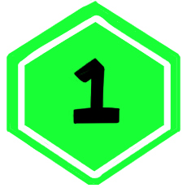

Rule Book Build: January 2024

**Homestuck: ATCG** is a competitive card-based game for 2- 4 players, similar to a trading card game, but with a deck-building mechanic that utilizes point-buy instead of randomized booster packs.

The game is designed to be played on the virtual platform, Tabletop Simulator, made by Berserk Games, and available through the Steam application.

(Homestuck: ATCG also has an alternative format that is co-operative, and can be played with 1-4 players. This format is called **Boss Mode**.)

## Before You Play
Before the game begins, all players must assemble their own deck in a process called “deck-building.” Every deck contains a total of 49 cards, with exactly one Planet Card included- but not every player's deck will be the same. *Deck-Building specifics will be covered later*.

**It is encouraged new players start with a pre-built deck (“Pre-Con”) for their first few games.** After a player understands the game play, building their own deck will allow them to optimize their chosen strategy.

## Goal of the Game
The winner of the game is the player who has the **most Victory Points (“VP”)** at the end of the game.

Players will score Victory Points by sending invaders to their opponent's planets and **overpowering opponent's planet and it's defenders**. However, players must make sure to defend their own planet from invaders, too!

Players will each take **turns** being the active player- and each turn is made up of multiple **phases**. When every player in the game has taken a turn, a new **round** begins.

Rounds continue with every player taking a turn, until any player has earned at least 7 VP. **The first time any player has 7+ VP at the end of a turn, this triggers the “end-game.”** Every other player besides the current player gets one more turn and then the game is over- and a winner is decided.

    <h3>Advanced</h3>
    
It's possible to earn VP during another player's turn, and thus it's possible to trigger end-game on another player's turn. The player with 7+ VP still gets their one additional turn in this scenario.

## Setting Up the Game
Every player puts their Planet Card into play in the “Planet Card” location on their play mat, with the Intact side face-up. (*The Intact side is the side with power!*)

Then, every player will shuffle the remaining cards in their own deck, and put the deck face-down. **Each player will draw five (5) cards from their own deck** and keep these in their hand, hidden from their opponents. This is their starting hand.

    

        <h3>Tabletop Simulator Controls</h3>
        <dl class="grid grid-cols-2">
            <dt>Shuffle a Deck</dt>
            <dd>Hover over Deck + “R” Key</dd>
            <dt>Draw 5 Cards into your Hand</dt>
            <dd>Hover over Deck + “5” Key</dd>
        </dl>
    

    

        <h3>Advanced</h3>
        
If you don't like the five cards you drew first, you may mulligan. A mulligan means putting all of the five cards back into the deck, shuffling again, and drawing another five cards to be your starting hand. Every time you mulligan, every other player gets 1 grist.

    

After all players have a starting hand- each player will roll a six-sided dice, re-rolling for any ties, and the player who rolled the highest number will have the first turn as the active player.

(The next active player is always the next player in a clock-wise order.)

The very first active player in a game will skip drawing any cards in their very first Prep Phase.

## Your Turn
A turn is made of multiple phases that must be completed in order. The first phase is the Prep Phase, which *prepares* you and your cards for action.

After the Prep Phase, the Main Phase happens. The Main Phase is where most of the player decisions and interaction happens. When the Main Phase is completed- either because the active player chooses to end it or they have no more grist to spend- the Score Phase begins. *Every action in the Main Phase must be resolved completely before the Score Phase begins*.

The Score Phase is when power totals at each planet are calculated, and players can earn Victory Points. **The Score Phase is skipped for the first Round**.

The final phase in a turn is Boon Phase.

    <h3>Phases of a Turn</h3>
    
PREP ==> MAIN ==> SCORE* ==> BOON

    
* Skipped in the First Round

### Prep Phase
#### Get Grist
The Prep Phase always begins by the Active Player earning Grist. Grist (g) is the currency in which players buy actions, such as playing cards, moving cards, using abilities and attacking. Most actions in the game will require grist to perform.

The amount of grist they earn during the Prep Phase depends on the highest number of VP any player in the game has. Grist is always based off the current highest VP earned by any player- not necessarily the VP of the active player. Only the active player gains Grist during their own Prep Phase.

<table class="p-4 mb-8 text-sm lg:w-1/3 mx-auto text-center">
    <thead>
    <tr>
        <th scope="col">Victory Points Earned ==></th>
        <th scope="col">Grist Earned</th>
    </tr>
    </thead>
    <tbody>
    <tr><td>0 VP</td><td>3g</td></tr>
    <tr><td>1-2 VP</td><td>5g</td></tr>
    <tr><td>3-5 VP</td><td>6g</td></tr>
    <tr><td>6+ VP</td><td>9g</td></tr>
    </tbody>
</table>

Grist is recorded by hexagon tokens kept near the player's deck. The green side indicates 1g, and the flipped-over blue side is 3g.

**A player can never have more than 12 grist**. If they would ever earn more grist when they already have 12, instead nothing happens.

**Players can choose to build up grist between turns**- they do not need to spend all the available grist every turn.

    

        <h3>Tabletop Simulator Controls</h3>
        <dl class="grid grid-cols-2">
            <dt>Flipping a Token/Card Over</dt>
            <dd>Hover over Token/Card + “F” Key</dd>
        </dl>
    

    

        <h3>Advanced</h3>
        
If any card says a player will earn additional grist in their Prep Phase, such as an effect on a Planet Card, the player will resolve that effect at the same time as the regular amount of grist gained. (They will gain this grist before refreshing or drawing.)

    

#### Refresh Cards
After a player gains Grist, they will refresh any and all cards they control at any location that are tapped. When a card is refreshed, it's turned upright and vertical. You must refresh every card that you control if it's tapped- you can't choose to keep it tapped.

(Tapping happens during the Main Phase, so there will not be any cards to refresh on your very first turn.)

#### Draw Cards
Now, you'll draw at least 1 card from your deck into your hand.

If you are the very first player in the game, on your very first turn, you won't draw at all. Every other turn after will always require a player draw at least one card.

    <h3>Tabletop Simulator Controls</h3>
    <dl class="grid grid-cols-2">
        <dt>Draw 1 Card into your Hand</dt>
        <dd>Hover over Deck + “1” Key</dd>
    </dl>

If your Planet Card is intact (face-up), you may choose to draw an additional amount of cards listed on the Planet's “Draw” attribute. You do not have to draw all the extra cards, but **you must decide if you'll draw the extra cards before you draw any cards at all**.

If your deck is empty when you need to draw a card, you have to immediately **mill**. When you mill, you shuffle your Discard Pile and return it to your Deck face-down, and continue drawing. **Whenever you mill, every other player gains +2 VP**. Thus, you want to make sure you're milling as little as possible. Milling can happen during any phase- whenever you need to draw and do not have cards in your deck.

    <h3>Advanced</h3>
    
The Nullified Pile is separate from the Discard Pile for a reason. Nullified Cards do not return to your Deck when you mill.

There is no “hand-limit”- you can have any number of cards in your hand. You can not choose to discard cards from your hand without playing them.

### Main Phase
Unlike the Prep Phase, where the same actions must be performed in a specific order, during a player's Main Phase they can mostly choose the order and type of actions they complete.

The actions an active player can choose during their Main Phase are:

- Play a Card from their Hand
- Move a Character Card
- Attack with a Character Card
- Activate the Ability of a Character Card
- End you Main Phase early

As long as you have grist, you may continue to take actions during your Main Phase. *If you ever have 0 Grist, and all actions have fully resolved, your Main Phase ends automatically.*

However, if you want to end the Main Phase with grist remaining- you may choose to end early (after all previous actions have fully resolved.) Remember though, you can never have more than 12 Grist!

#### Playing a Card
Playing a card (also known as “entering” the card) means moving a card from your hand onto the table. Cards must always be in- play before they have any sort of effect on the game.

To play a card, you must first pay it's Enter Cost in full. This is found on middle right-hand side of the card, in a box labeled “Enter.” Most cards have an enter cost of grist.

**You can choose to enter a Character Card to any planet**. Your own character at your own planet is a *defender*, while your character at any opponent's planet is an *invader*. A character does not need to start at your own planet, but can be directly played as an invader.

**Inventory cards can only enter play as “attached” to the specific card type listed on that Inventory Card**. They can not be in-play without something to attach to. However, you can choose to attach them to any in-play card that fits the requirements, at any location.

**Executable cards enter play only in your Executable Zone**. When you play an Executable Card, make sure you arrange them in your Executable Zone in the order you play them, right-to-left. (*This is very important for when Executable Cards are triggered, as they resolve right-to-left.*) You can not re-arrange or move Executable Cards once they are played.

There are some cards that have an Enter cost listed as “~ATH: (X)” ~ATH (*read as Tilde-ath, or “'til Death”*) is Executable coding.

As an Enter cost, this means that card can not be played until the (X) card has been discarded or destroyed. When the triggering card is discarded or destroyed, you may choose to immediately play that card. You do not have to enter a card with an Executable Enter Cost when it is triggered- you can choose to keep it in your hand. However, you can only play these cards immediately after the triggering card is discarded or destroyed. (If you choose not to enter the card then, you must wait until it's triggered again.)

You can play Executable coded Enter Cost cards during any player's turn- as long as it's immediately after a triggering card was discarded or destroyed. You can also play these cards to any appropriate location, just like cards with an enter cost of grist.

    <h3>Advanced</h3>
    
A card is still considered “destroyed” when it is nullified.

**Example 1:**

“GAMZEE MAKARA / The Mirthful Messiahs” has an enter cost of “~ATH: Any #TROLL.” You have the card in your hand.

During your opponent's main phase, they attack and destroy your defending #TROLL card. You can now choose to put “GAMZEE MAKARA / the mirthful messiahs” into play, even as an invader. However- because it's not your main phase- your card can not attack or use an ability yet.

**Example 2:**

During your main phase, you attack and destroy your opponent's invader #TROLL. You can now choose to put “GAMZEE MAKARA / the mirthful messiahs” into play, because the code says “any” #TROLL- not specifically your own #TROLL. You can immediately choose to have the card attack, because it is your own Main Phase.

#### Move a Character Card
Once your character card has entered, they can change their location to a new planet by being moved. **Moving a character card always costs 2 grist**- no matter what their enter cost is. The 2 grist must be paid before a character moves.

Once a character card has moved, it will become tapped and loose all boons it might've had.

    <h3>Advanced</h3>
    
A character will always be tapped and loose all boons when it moves- even if the movement is caused by effect from an ability or other card during any player's turn.

Any Inventory card that is attached to the character moves with the character it's attached to. Inventory can not be moved on it's own.

Executable Cards can not be moved or re-arranged.

#### Tapping

    <h3>Tabletop Simulator Controls</h3>
    <dl class="grid grid-cols-2 mb-6">
        <dt>Rotate a Card</dt>
        <dd>Hover over the Card + “E” Key</dd>
    </dl>

The amount of rotation per key-press depends on the rotate setting- click on the setting on the top of the screen to change it to 90 degrees to reduce key-presses.

When a card is “tapped”, the card is physically rotated 90 degrees and put on it's side. **Once a card is tapped, it can not be tapped again until it is refreshed**. You can't choose to take any action with your own card that would cause it to be tapped more than once. *Choose wisely*.

#### Attack with a Character Card

## Score

## Boon